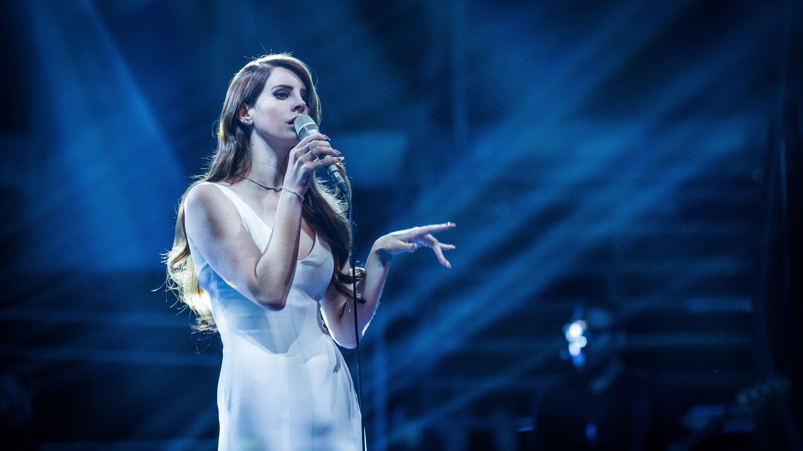
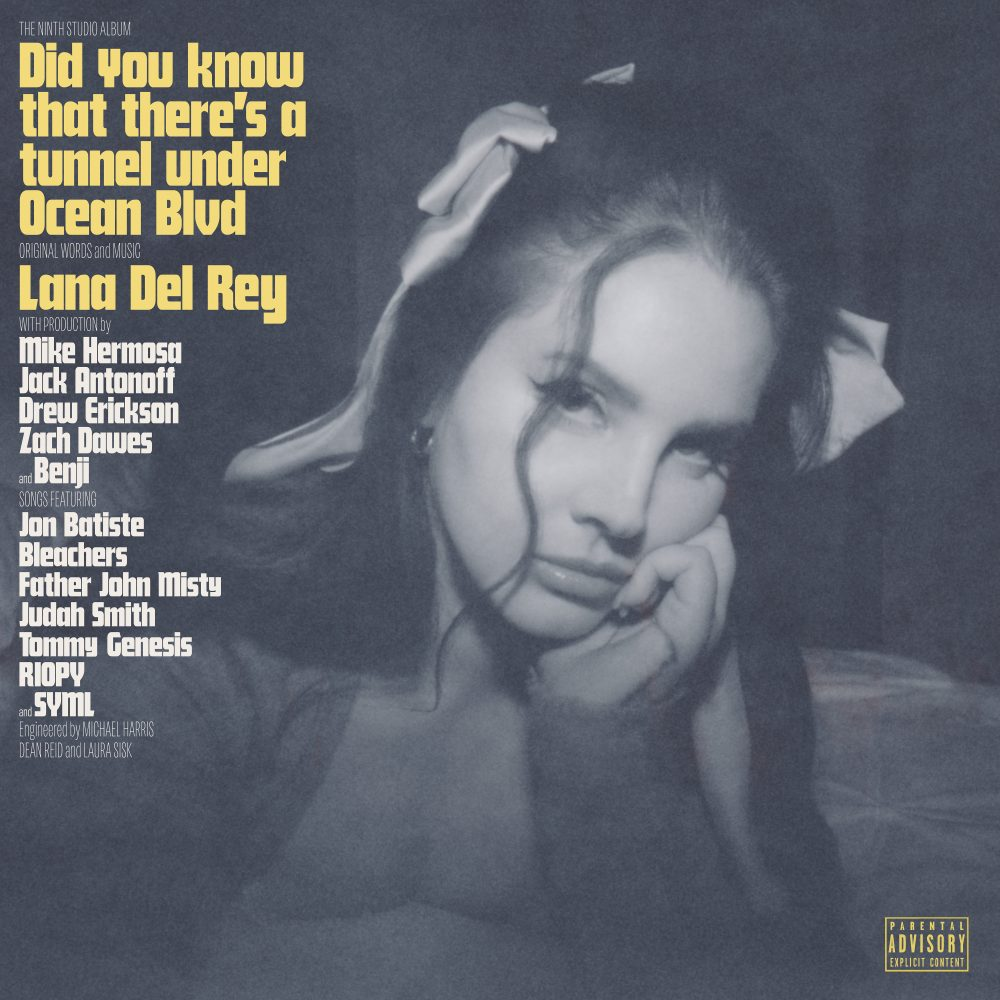
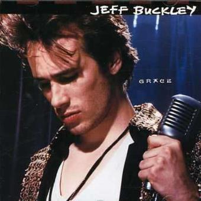
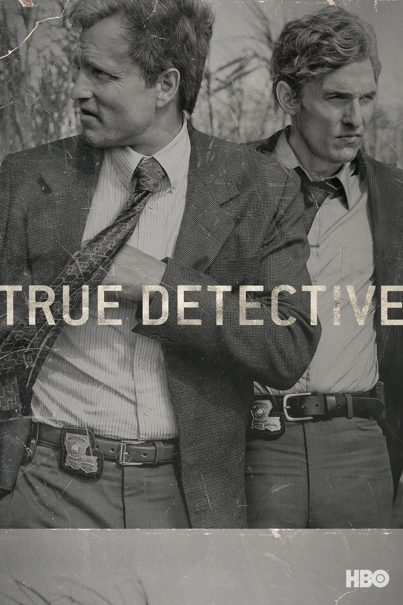
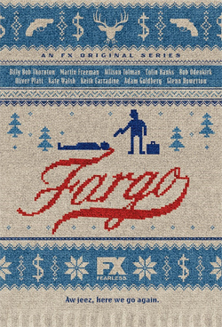

<link rel="stylesheet" href="styles.css">

<h1> 🩵 Welcome To My Page 🩵 </h1>

<h2>Getting to know me...</h2>

```js
bruno.hometown
=> "Viseu, 🇵🇹"

bruno.majors
=> ["Computer Science and Engineering", "Biomedical Sciences"]

bruno.learning
=> ["React", "GraphQL", "Tailwind-CSS"]

bruno.interests
=> ["Snooker 🎱", "Tennis 🎾", "Writting ✍🏽", "Movies 🎥", "Nature 🌬️", "Music 🎶"]

bruno.languages
=> {
    🇵🇹: "native",
    🇬🇧: "intermediary",
    🇨🇳: "basic",
    🇪🇸: "basic"
    }

bruno.nicknames
=> ["deft", "aqu4riu-S"]
```

<hr>


---

<h2>Github Stats</h2>

<table>
  <tr>
    <td valign="top"><a href="https://github.com/anuraghazra/github-readme-stats">
  
</a></td>
    <td valign="top"><a href="https://github.com/anuraghazra/github-readme-stats">
  
</a></td>
  </tr>
</table>

<div style="display:flex; justify-content:center">
<p></p>
</div>

---

<h2>Trophies</h2>

<p align="left" style="text-align:center"> <a href="https://github.com/ryo-ma/github-profile-trophy"></a> </p>

---

<h2>#30NitesOfCode Challenge:</h2>


[Take a look at deftyy's journey! 😊](https://www.codedex.io/@deft/30-nites-of-code)

---



> “Being brave means that knowing when you fail, you won't fail forever.”
>
> By [Lana Del Rey](https://en.wikipedia.org/wiki/Lana_Del_Rey)

---

<h2>My all-time art</h2>

<h3>Albums 💿</h3>

<table>
  <tr>
    <td valign="top"></img></td>
    <td valign="top"></img></td>
    <td valign="top"></img></td>
    <td valign="top"></img></td>
  </tr>
</table>

---

<h3>Movies 🎥</h3>

<table>
  <tr>
    <td valign="top"></img></td>
    <td valign="top"></img></td>
    <td valign="top"></img></td>
    <td valign="top"></img></td>
  </tr>
</table>

---

<h3>TV Shows 📺</h3>

<table>
  <tr>
    <td valign="top"></img></td>
    <td valign="top"></img></td>
    <td valign="top"></img></td>
    <td valign="top"></img></td>
  </tr>
</table>
